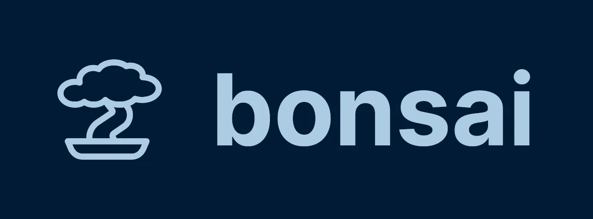

Bonsai:  A Bitcoin Software Development Environment by EntangleIT.com
Version:  v0.1.0.1

Author:  EntangleIT.com == RAH@EntangleIT.com / Auxon0@hotmail.com / Richard.Hein@gmail.com

Paymail:  $auxon11, auxon@moneybutton.com, RichardHein@moneybutton.com

PGP fingerprint:  F6CC D83D DF70 FA93 0AF1 5443 863E C244 E60D AEEC

*******************************************************************************
*  Bonsai is a decentralized software development network built on Bitcoin SV *
*******************************************************************************

The genesis block contains the stem cell instructions. 
 
Planned Features:  

*Peer-to-peer source control system.

*Secured by the Bitcoin blockchain via merge mining.

*Immutable history.

*Automatic payments of royalities to contributers.

*Copyright management.

*Versioning management.

*Advanced code completion and searching capabilities.

*Machine learning.

*Neural Networks.

*DNA computing simulation.

*Quantum computing simulation.

*Next generation, machine learning based malware and virus protection.

*Secure multi-party computation using bulletproofs, z-snarks, and partial and fully-homomophic encryption for critical code and data.

 
 
*Earn mining rewards by writing:

    *Code.
    
    *Tests, test data, and training data.
    
    *Documentation and comments.
    
    *Localization & Globalization of all code, tests, documentation and comments.
    
    *Optimizations, overloads.
    
    
*Earn mining rewards by operating Bonsai nodes:

    *Long to short-term memory nodes - cache/RAM/SSD/HDD/Tape/Optical storage.
    
    *Runtime nodes.
    
    *Test execution nodes.
    
    *Machine learning nodes.
    
    
Bonsai is in beta development with plans to release an alpha in July 2024 and a full 1.0 release by January 1, 2025.

# Project Plan - Updated 2024-03-09.  

To simplify the implementation plan for the features outlined for Bonsai, a decentralized software development network built on Bitcoin SV, we can organize the tasks into several core areas. This approach will help in focusing development efforts, managing complexity, and ensuring a comprehensive coverage of the system's goals.

### 1. Core Blockchain Integration
- **Merge Mining with Bitcoin SV:** Research and implement the technical details of merge mining to secure Bonsai with the Bitcoin blockchain.
- **Immutable History via Blockchain Transactions:** Design and implement the structure for storing development activities as transactions on the blockchain.

### 2. Development Tools and Infrastructure
- **Peer-to-Peer Source Control System:** Develop a decentralized version control system that operates over a peer-to-peer network.
- **Versioning Management:** Create mechanisms for version control and dependency management that leverage blockchain immutability.
- **Copyright and Royalties Management:** Implement smart contracts or similar constructs to automate copyright claims and royalty payments to contributors.

### 3. Advanced Development Features
- **Code Completion and Search:** Integrate or develop advanced machine learning algorithms for code suggestion and intelligent search functionalities.
- **Simulation Environments:** Build simulation environments for DNA computing, quantum computing, and other emerging technologies.

### 4. Security Features
- **Malware and Virus Protection:** Develop a next-generation security system using machine learning to detect and protect against malicious code.
- **Secure Multi-Party Computation:** Implement cryptographic protocols like bulletproofs, z-snarks, and homomorphic encryption for protecting critical code and data.

### 5. Node Operations and Mining Rewards
- **Node Types Specification:** Define the roles and functionalities of different node types (e.g., storage, runtime, test execution, machine learning).
- **Mining Rewards System:** Design and implement the rewards system for various contributions, including code, documentation, and node operation.

### 6. Community and Governance
- **Contribution and Governance Models:** Establish clear guidelines for contributions, governance, and decision-making processes within the Bonsai network.
- **Localization & Globalization:** Ensure tools and platforms support internationalization, allowing for global participation and use.

### 7. Project Management and Milestones
- **Pre-Alpha to Alpha Transition:** Outline the key deliverables, quality assurance measures, and community engagement plans for transitioning from pre-alpha to alpha.
- **Alpha to Full Release Roadmap:** Develop a detailed roadmap from alpha release to the full 1.0 release, including milestones, beta testing phases, and user feedback loops.

### Implementation Approach
- **Iterative Development:** Adopt an agile methodology, allowing for iterative development, testing, and feedback at each stage.
- **Community Involvement:** Engage with the developer community early and often to gather feedback, contributions, and to foster a collaborative ecosystem.
- **Security and Scalability First:** Prioritize security and scalability in the design and development phases to ensure the network can handle growth and resist attacks.

By structuring the development plan into these focused areas, the Bonsai team can tackle the complexity of building a comprehensive decentralized development environment while ensuring that each component integrates seamlessly to fulfill the project's ambitious goals.

# BITWORK and BONSAI Integration 
Integrating Bitwork into the Bonsai system can be a strategic move to enhance its capabilities, especially when it comes to simplifying interactions with the Bitcoin network. Since Bonsai is a decentralized software development network built on Bitcoin SV, and Bitwork provides an easy yet powerful way to process data from the Bitcoin network, it seems like a natural fit.

Here’s a high-level approach on how you might consider using Bitwork to fulfill the planned features of Bonsai:

### Peer-to-Peer Source Control System:
Utilize Bitwork’s simplified network interaction to handle data retrieval and submission to the Bitcoin SV blockchain, which can serve as the backbone for a decentralized version control system.

### Secured by Bitcoin Blockchain via Merge Mining:
Leverage Bitwork’s P2P capabilities to observe and verify mining activities, and possibly extend Bitwork's capabilities to integrate merge mining functionalities directly.

### Immutable History & Versioning Management:
Bitwork can streamline fetching block data, which can represent different versions of code, ensuring that the historical progression of the development is immutably recorded.

### Automatic Payments of Royalties to Contributors & Copyright Management:
With Bitwork’s transaction handling, you can construct transactions that represent royalty payments based on smart contracts or predefined criteria. The blockchain data can also be used to enforce copyright claims.

### Advanced Code Completion and Searching Capabilities:
Although this feature is more UI and IDE focused, Bitwork’s data fetching capabilities can be used to search the blockchain for code snippets, documentation, and other development-related artifacts.

### Machine Learning & Neural Networks:
For these features, you may need to build specific components that are not directly related to Bitwork’s current functionality but can use data obtained from Bitwork for training ML models or simulating neural network behaviors.

### DNA Computing & Quantum Computing Simulation:
These advanced simulations would likely be separate modules within Bonsai that utilize blockchain data fetched via Bitwork for various simulation parameters or initialization data.

### Security Features:
Bitwork’s direct interaction with the Bitcoin network can be leveraged to create a secure layer within Bonsai for handling blockchain-based operations. Adding encryption and privacy measures will be necessary here.

### Node Operations:
You could use Bitwork to manage node-specific data, such as the current state of the blockchain, mempool transactions, and more, providing a real-time view for node operators within Bonsai.

For the integration of Bonsai and Bitwork, the following technical steps may be considered:

1. **API Extension/Creation**: Extend Bitwork’s API or create a new layer to handle specific Bonsai functionalities that are not currently part of Bitwork, such as file versioning, contributor royalties, and copyright management.

2. **Middleware Development**: Develop middleware for Bitwork to handle specific data processing steps required by Bonsai, like parsing blockchain data into file versions or project milestones.

3. **Smart Contract Integration**: Integrate smart contract execution and monitoring within Bitwork to automate Bonsai-specific processes like royalty distributions.

4. **UI Integration**: Design and implement user interfaces in Bonsai that interact with Bitwork’s API to provide seamless access to the underlying Bitcoin SV network operations.

5. **Customization for Scale**: Customize Bitwork to handle the high throughput and data demands anticipated for Bonsai, especially considering the potential scale of Bitcoin SV's block size.

6. **Testing and Validation**: Thoroughly test the integrated system to ensure that Bitwork's data fetching and real-time blockchain interaction meet the needs of Bonsai.

7. **Documentation and Tutorials**: Update documentation and create tutorials that clearly explain how to use the Bonsai features powered by Bitwork.

8. **Performance Optimization**: Continuously monitor and optimize the performance of the integrated system, especially concerning the large scale of data involved with Bitcoin SV.

By combining the strengths of Bitwork's networking simplicity and Bonsai's comprehensive development network goals, you could create a robust and user-friendly system that enhances the developer experience on the Bitcoin SV blockchain.
